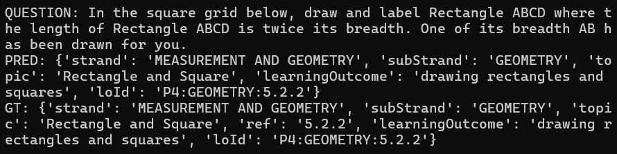
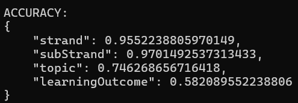

# Math Question Classifier

This is a command line program that uses OpenAI's GPT-5.2 model to classify math questions.
It takes in an input, the math question, and refers to a syllabus.json to predict what the `learning outcome`, `strand`, `sub-strand`, `topic` and `loId` of that question is.

There are 2 main parts to this program:
1. parse_syllabus.py
2. main.py

## Installation and Preparation

Don't forget to `pip install -r requirements.txt` first to install the required Python modules for this program.

During testing, the program used a Vercel AI gateway API key provided by Wild Dynasty to access the GPT-5.2 model. For the sake of confidentiality I cannot provide that same key I used in this repository. Instead, you should generate your own Vercel API key to access the GPT-5.2 model. Then, assign it as `WD_API_KEY` in the `.env` file.

## parse_syllabus.py

For this task, I was given a [Notion link](https://bramble-century-072.notion.site/Syllabus-31913c0ea6608055ac51dd3fca4e4d7c) containing tables for the P3 and P4 syllabi. The purpose of `parse_syllabus.py` is to parse those tables into a json file.

First, copy the tables into text files. The text file for the P3 syllabus table should be named `P3_syllabus.txt` and the file for the P4 syllabus table should be named `P4_syllabus.txt`. Place the files in the `data` folder.

(Should you want to have more syllabus tables (eg. P5, P6, etc.), simply include their text files with the same naming format stated above in the 'data' folder.)

Then, run `python parse_syllabus.py`.

The program should output a json file called `syllabus.json`.

Taking a look inside, the json has a long list of items in the following format:
>{  
    "strand": "",  
    "subStrand": "",  
    "topic": "",  
    "learningOutcome": "",  
    "loId": ""  
}

As can be seen, each item corresponds to each learning outcome in the syllabus tables. They also contain the Strand, Sub-Strand, Topic and loId associated with that learning outcome.

This is the expected output format to an input math question by the classification engine. As such, parsing the syllabus into a json will make it easier for the model to output the correct format later. It is essentially giving the model a list of possible "answers" to choose from.

## main.py

With our `syllabus.json` ready, we can run the main classifcation script.

Run `python main.py`.

The program will first prompt you for the link to get the math questions from. For my test run, I used the provided link (https://api-v1.zyrooai.com/api/v1/math-classifier/interview/questions).

Once you have entered the link, the rest of the program should run itself.

This is an example of an output item:

The program prints the following to the terminal:  

`QUESTION`: The math question posed to the model.  

`PRED`: The model's prediction of the Strand, Sub-Strand, Topic, Learning Outcome and loId associated with the question, by referencing syllabus.json.

`GT`: Ground-truth label for the question, obtained from the link provided.

Finally, at the end, the overall accuracy is printed. In my test run of the program, the model predicted correctly for Strand for 95% of all questions, predicted correctly Sub-Strand for 97% of all questions, predicted correctly for Topic for 74% of all questions and predicted correctly for Learning Outcome for 58% of all questions.

## Disclaimer

parse_syallbus.py actually uses the GPT-5.2 model to output syllabus.json in the desired format, as opposed to manually making syllabus.json or scripting it. As such, it may be worth parsing it manually BEFORE running main.py to eliminate any inaccuracies during the conversion from table to json. That said, an examination of syllabus.json proved that the model's output is very accurate.